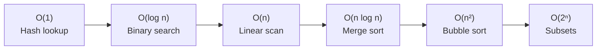

# Algorithms & Data Structures in Python

<p align="center">
  
  
  
  
  
</p>

Clean Python implementations of **50+ classic algorithms and data structures**, each with Big-O complexity annotations and test coverage. Built as a study reference and interview prep resource.

---

## 📚 Covered Topics

### Data Structures
| Structure | Operations |
|-----------|-----------|
| Linked List (Singly + Doubly) | insert, delete, reverse, cycle detection |
| Stack / Queue | LIFO/FIFO, monotonic stack |
| Binary Tree / BST | insert, search, traversals (BFS/DFS) |
| Heap (Min/Max) | heapify, push, pop |
| Hash Map | open addressing, chaining |
| Graph (Adjacency List) | BFS, DFS, topological sort |
| Trie | insert, search, prefix match |

### Algorithms
| Category | Algorithms |
|----------|-----------|
| Sorting | Bubble, Merge, Quick, Heap, Counting, Radix |
| Searching | Binary Search, Linear, Jump |
| Graph | Dijkstra, Bellman-Ford, A*, Kruskal, Prim |
| Dynamic Programming | Knapsack, LCS, LIS, Coin Change, Edit Distance |
| Recursion | Tower of Hanoi, N-Queens, Permutations |
| String | KMP, Rabin-Karp, Anagram detection |

---

## ⏱️ Complexity Reference



---

## 🚀 Quick Start

```bash
pip install pytest
pytest tests/          # run all tests
python examples/bst.py # run a specific example
```

---

## 📁 Structure

```
src/
├── data_structures/
│   ├── linked_list.py
│   ├── binary_tree.py
│   ├── heap.py
│   └── graph.py
└── algorithms/
    ├── sorting/
    ├── searching/
    ├── dynamic_programming/
    └── graph/
tests/
```

---

## 📄 License

MIT
